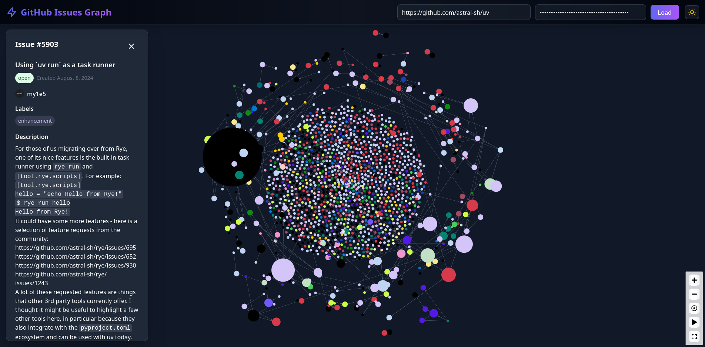

# Graph Issues

A web application for visualizing a Github repository's open issues in a directed graph format. 

[Live Demo](https://jeettrivedi.github.io/graph-issues)

## Features 

- **Private Repository Support**: Securely connect to private repositories using your GitHub authentication token
- **Visual Insights**: 
  - Nodes are dynamically sized based on their connectivity
  - Color-coded nodes reflect GitHub issue labels
  - Interactive visualization of issue relationships
- **Interactive Exploration**: Click any node to view detailed issue information

## Preview

## Potential Improvements

This is a very quickly hacked together application and by no means a polished finished product. My objective was mostly curiousity about what these graphs looked like for some of the very active repositories. I can think of many ways this can be improved. Here are a few:

- **Enhanced Filtering**:
  - Filter issues by label type
  - Toggle visibility of isolated nodes (degree 1)
  - Search functionality for issue titles and descriptions
  - Filtering by time ranges
- **User Experience**:
  - Persist GitHub token in local storage
  - Save and load graph layouts
- **Visualization**:
  - Customize node colors and sizes
  - Add tooltips with issue previews
  - Export graph as image or JSON

## Contributing

We welcome contributions! Please follow these guidelines:

1. Fork the repository
2. Create a new branch for your feature or bugfix
3. Make your changes
4. Submit a pull request with a clear description of your changes

## License

This project is licensed under the MIT License.